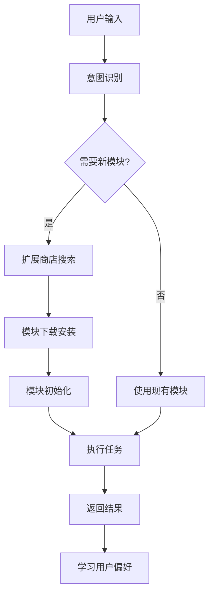

# MirrorCore - 智能模块化AI代理系统 🤖

<div align="center">


[](https://opensource.org/licenses/Apache-2.0)


**下一代智能AI代理系统** - 通过智能判断自动加载功能模块，实现传统聊天无法完成的高级任务

[快速开始](#-快速开始) • [核心愿景](#-核心愿景) • [智能模块](#-智能模块示例) • [扩展商店](#-扩展商店) • [贡献指南](CONTRIBUTING.md)

</div>

---

## 🎯 核心愿景

MirrorCore是一个**革命性的智能AI代理系统**，其核心理念是：**AI根据聊天内容智能判断并自动加载所需的高级功能模块**，从而实现传统聊天机器人无法完成的复杂任务。

### 🧠 智能模块加载机制
- **意图识别**：AI分析用户对话内容，智能识别所需功能
- **自动预加载**：从扩展商店自动获取并加载相应功能模块
- **无缝集成**：模块加载过程对用户透明，提供流畅体验
- **动态扩展**：根据使用场景动态组合多个模块协同工作

### 🏪 扩展商店生态
- **模块化架构**：每个功能都是独立的可插拔模块
- **智能推荐**：根据用户习惯和需求推荐合适的模块
- **开发者生态**：支持第三方开发者贡献功能模块
- **版本管理**：模块的版本控制和自动更新机制

### 📱 全平台部署愿景
**当前阶段**：开发者验证版本 - 本地测试和功能验证
**未来目标**：商业版本 - 可部署在手机、电脑和一切智能设备上
- 前后端分离的云端架构
- 跨平台兼容性
- 企业级安全和性能保障

---

## 🚀 智能模块示例

### 📧 邮件助手模块
**触发场景**：*"帮我给联系人小A发送一封邀请邮件"*
- **智能识别**：AI检测到邮件发送需求
- **自动加载**：从扩展商店预加载邮件模块
- **智能处理**：
  1. 自动拟写邮件内容
  2. 提供预览和修改界面
  3. 用户确认后调用Gmail/Outlook API发送
  4. 支持联系人管理和邮件模板

### 🎮 内容发现模块
**触发场景**：*"搜索明日方舟新活动的攻略"*
- **智能识别**：AI理解游戏攻略搜索需求
- **自动加载**：预加载视频内容模块
- **智能处理**：
  1. 分析用户观看习惯
  2. 自动打开Bilibili/YouTube
  3. 推荐常看博主的相关视频
  4. 提供攻略内容摘要和时间戳

### 🏃‍♂️ 健康管理模块
**触发场景**：*"帮我计算今天的卡路里并监控运动"*
- **智能识别**：AI检测到健康管理需求
- **自动加载**：卡路里计算 + 日程管理模块
- **智能处理**：
  1. **拍照识别**：拍摄食物自动计算卡路里
  2. **语音输入**：口述食物快速记录
  3. **运动计划**：结合日程安排科学计算消耗
  4. **长期跟踪**：制定和监控健康计划

### 📅 智能日程模块
**触发场景**：*"帮我安排明天的日程"*
- **智能识别**：AI理解日程规划需求
- **自动加载**：日程管理 + 通知模块
- **智能处理**：
  1. **习惯学习**：根据历史数据制定合理安排
  2. **智能提醒**：计划开始前通过多端通知
  3. **跨设备同步**：手机和电脑同步提醒
  4. **动态调整**：根据实际情况智能调整计划

### 🔧 开发助手模块
**触发场景**：*"帮我重构这个React组件"*
- **智能识别**：AI检测到代码开发需求
- **自动加载**：代码分析 + 项目管理模块
- **智能处理**：
  1. **代码理解**：深度分析现有代码结构
  2. **重构建议**：提供最佳实践方案
  3. **自动实现**：生成优化后的代码
  4. **测试验证**：自动运行测试确保功能正常

---

## 🏪 扩展商店

### 模块分类
- **📧 通信模块**：邮件、短信、社交媒体集成
- **📱 生活助手**：健康管理、日程规划、购物助手
- **🎯 娱乐内容**：游戏攻略、视频推荐、音乐发现
- **💼 办公效率**：文档处理、数据分析、会议管理
- **🛠️ 开发工具**：代码助手、项目管理、部署自动化
- **🏠 智能家居**：设备控制、环境监控、安全管理

### 模块特性
- **即插即用**：无需手动安装，AI智能加载
- **个性化配置**：根据用户习惯自动调优
- **安全隔离**：模块间相互独立，确保系统安全
- **版本管理**：自动更新和兼容性检查
- **性能优化**：按需加载，不占用系统资源

### 开发者生态
- **开放API**：提供标准化的模块开发接口
- **开发工具**：完整的SDK和调试工具链
- **社区支持**：开发者论坛和技术支持
- **收益分享**：模块使用量化收益模式

---

## 🏗️ 系统架构

```
┌─────────────────────────────────────────────────────────────┐
│                    用户交互界面                               │
│  - 自然语言对话界面                                           │
│  - 模块状态监控                                               │
│  - 个性化设置面板                                             │
└──────────────────────┬──────────────────────────────────────┘
                       │
                       │ 实时通信协议
                       │
┌──────────────────────┴──────────────────────────────────────┐
│                  AI智能判断引擎                               │
│  - 意图识别与理解                                             │
│  - 模块需求分析                                               │
│  - 智能决策系统                                               │
├─────────────────────────────────────────────────────────────┤
│                  扩展商店管理器                               │
│  - 模块发现与推荐    - 自动下载与安装    - 版本管理           │
│  - 依赖关系解析      - 安全性检查        - 性能监控           │
├─────────────────────────────────────────────────────────────┤
│                  动态模块加载层                               │
│  📧 邮件模块        📅 日程模块        🏃‍♂️ 健康模块          │
│  🎮 内容发现        🔧 开发助手        🏠 智能家居            │
│  💼 办公效率        📱 生活助手        🎯 娱乐内容            │
├─────────────────────────────────────────────────────────────┤
│                  核心服务层                                   │
│  - API网关服务      - 数据存储服务      - 安全认证服务        │
│  - 消息队列服务      - 缓存服务          - 日志监控服务        │
├─────────────────────────────────────────────────────────────┤
│                  AI推理与学习层                               │
│  - 大语言模型集成 (GPT-4, Claude, Qwen)                   │
│  - 用户行为学习与个性化                                       │
│  - 上下文记忆与知识图谱                                       │
└─────────────────────────────────────────────────────────────┘
```

### 🔄 智能模块加载流程



### 技术栈

| 层次 | 技术选型 | 说明 |
|------|----------|------|
| **AI推理引擎** | OpenAI GPT-4, Claude, 本地模型 | 多模型支持，智能切换 |
| **后端核心** | Node.js, TypeScript, Express | 高性能异步处理 |
| **模块管理** | Docker, Kubernetes | 容器化部署，弹性扩展 |
| **前端界面** | Electron, React, WebSocket | 跨平台桌面应用 |
| **数据存储** | MongoDB, Redis, Vector DB | 多类型数据存储 |
| **消息队列** | RabbitMQ, Apache Kafka | 高并发消息处理 |
| **安全认证** | JWT, OAuth 2.0, 端到端加密 | 企业级安全保障 |

### 🔐 安全与隐私

- **模块沙箱**：每个模块运行在独立的安全环境中
- **权限控制**：细粒度的API访问权限管理
- **数据加密**：端到端加密保护用户隐私
- **审计日志**：完整的操作记录和安全审计
- **合规认证**：符合GDPR、SOC2等安全标准

---

## 📁 项目结构

```
MirrorCore/
├── backend/                 # 智能体核心引擎
│   ├── src/
│   │   ├── routes/         # API路由和功能接口
│   │   ├── services/       # 核心服务模块
│   │   ├── middleware/     # 中间件和拦截器
│   │   └── server.ts       # 智能体服务器入口
│   └── package.json
├── desktop/                # 智能体前端界面
│   ├── src/
│   │   ├── main.ts         # Electron主进程
│   │   └── preload.ts      # 安全预加载脚本
│   ├── renderer/
│   │   ├── index.html      # 交互界面
│   │   ├── styles.css      # UI样式
│   │   └── renderer.js     # 前端逻辑
│   └── package.json
├── shared/                 # 共享类型和工具
│   └── src/
│       ├── types/          # TypeScript类型定义
│       └── constants/      # 系统常量
├── docs/                   # 智能体文档
│   ├── API.md             # 功能模块API文档
│   ├── DEVELOPMENT.md     # 开发指南
│   └── GETTING_STARTED.md # 快速入门
├── scripts/               # 自动化脚本
└── mobile/                # 移动端支持（规划中）
```

---

## 🚀 快速开始

### 环境要求

- Node.js 18+
- 现代浏览器支持
- 网络连接（智能体需要联网功能）

### 快速部署

```bash
# 1. 克隆智能体项目
git clone https://github.com/your-username/MirrorCore.git
cd MirrorCore

# 2. 安装依赖
npm install
cd backend && npm install && cd ..
cd desktop && npm install && cd ..

# 3. 配置AI服务
cd backend
cp .env.example .env
# 编辑.env文件，配置AI API密钥

# 4. 启动智能体系统
npm run dev:backend    # 终端1: 启动智能体引擎
npm run dev:desktop    # 终端2: 启动前端界面
```

### AI服务配置

智能体支持多种AI服务提供商：

```bash
# OpenAI配置
AI_PROVIDER=openai
OPENAI_API_KEY=your_openai_api_key

# Claude配置  
AI_PROVIDER=claude
CLAUDE_API_KEY=your_claude_api_key

# 自定义API配置
AI_PROVIDER=custom
AI_API_KEY=your_api_key
AI_BASE_URL=https://your-api-endpoint.com/v1
```

---

## 🎯 使用场景

### 开发助手
- **代码审查**：自动分析代码质量和潜在问题
- **重构建议**：提供代码优化和架构改进建议
- **文档生成**：自动生成API文档和使用说明

### 项目管理
- **任务规划**：将需求分解为具体的开发任务
- **进度跟踪**：监控项目进展和里程碑
- **质量保证**：自动化测试和代码检查

### 自动化操作
- **环境配置**：自动设置开发环境和依赖
- **部署管理**：自动化构建和部署流程
- **监控报告**：系统状态监控和异常报告

---

## 🔧 开发指南

### 添加新功能模块

1. 在`backend/src/services/`中创建模块服务
2. 在`backend/src/routes/`中添加API路由
3. 更新前端界面以支持新功能
4. 编写模块文档和测试用例

### 智能体能力扩展

```typescript
// 示例：添加新的智能体功能
interface AgentModule {
  name: string;
  description: string;
  execute: (params: AgentParams) => Promise<AgentResult>;
  capabilities: string[];
}
```

---

## 📚 文档

- [API文档](docs/API.md) - 功能模块接口说明
- [开发指南](docs/DEVELOPMENT.md) - 智能体架构和开发规范
- [快速入门](docs/GETTING_STARTED.md) - 新手使用指南

---

## 🚀 发展路线图

### 🎯 当前阶段：开发者验证版本 (v0.x)
**目标**：功能验证和技术可行性证明
- ✅ 基础对话界面和后端架构
- ✅ 核心AI推理引擎集成
- 🔄 智能模块加载机制开发
- 🔄 扩展商店原型设计
- 📋 用户体验测试和优化

### 🏢 第一阶段：商业版本 (v1.x)
**目标**：前后端分离的云端部署版本
- **云端架构**：微服务化部署，支持弹性扩展
- **多用户支持**：企业级用户管理和权限控制
- **扩展商店上线**：官方和第三方模块生态
- **API开放平台**：为开发者提供模块开发工具
- **安全合规**：企业级安全认证和隐私保护

### 📱 第二阶段：全平台部署 (v2.x)
**目标**：跨设备智能代理生态
- **移动端应用**：iOS/Android原生应用
- **Web端支持**：浏览器版本，无需安装
- **智能设备集成**：
  - 智能音箱和语音助手
  - 智能手表和可穿戴设备
  - 车载系统和IoT设备
  - 智能家居控制中心

### 🌐 第三阶段：AI代理网络 (v3.x)
**目标**：构建智能代理协作网络
- **多代理协作**：不同专业领域的AI代理协同工作
- **知识共享网络**：代理间的知识和经验共享
- **自主学习进化**：基于用户反馈的持续学习
- **生态系统建设**：开发者、用户、企业的完整生态

---

## 💡 商业模式

### 🎯 目标市场
- **个人用户**：追求效率和智能化生活的用户
- **企业客户**：需要智能化办公和自动化的企业
- **开发者生态**：希望构建AI应用的开发者
- **设备制造商**：智能设备和IoT厂商

### 💰 收益模式
- **订阅服务**：按月/年收费的高级功能
- **模块商店**：扩展模块的销售分成
- **企业定制**：为企业客户提供定制化解决方案
- **API服务**：为开发者提供AI能力API
- **硬件合作**：与设备厂商的预装合作

### 🎨 差异化优势
- **智能模块加载**：业界首创的AI驱动模块系统
- **无缝用户体验**：用户无需学习，AI自动适配
- **开放生态系统**：支持第三方开发者贡献
- **全平台覆盖**：从桌面到移动到IoT的全覆盖
- **隐私优先**：用户数据安全和隐私保护

---

## 📄 许可证

Apache License 2.0 - 详见 [LICENSE](LICENSE) 文件

---

## 🤝 贡献

欢迎为MirrorCore智能体系统贡献代码和想法！

1. Fork项目
2. 创建功能分支 (`git checkout -b feature/NewAgentCapability`)
3. 提交更改 (`git commit -m 'Add new agent capability'`)
4. 推送分支 (`git push origin feature/NewAgentCapability`)
5. 创建Pull Request

---

<div align="center">

**[⬆ 回到顶部](#mirrorcore---联网ai智能体系统-)**

Made with ❤️ by MirrorCore AI Agent Team

</div>

